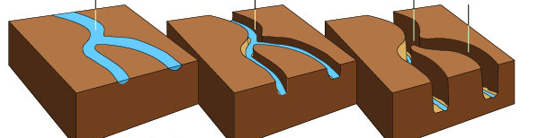
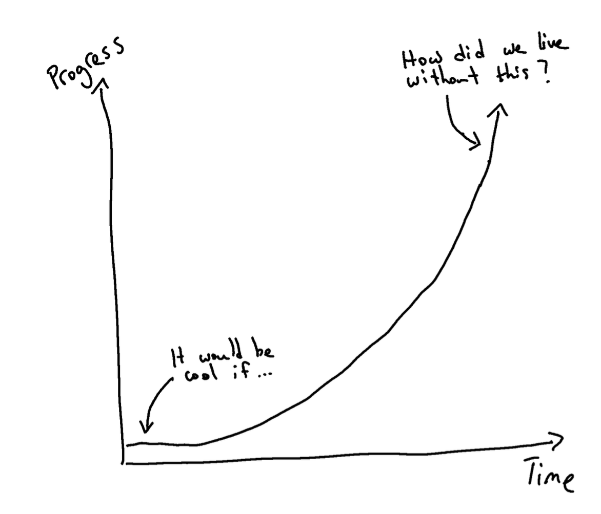
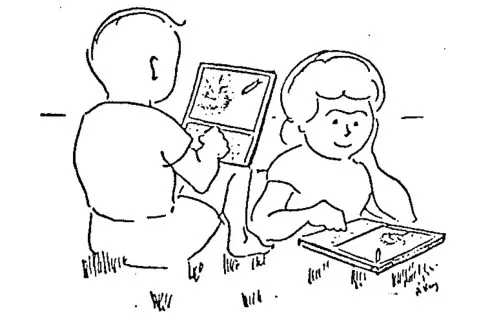
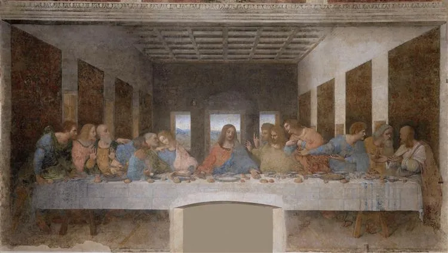
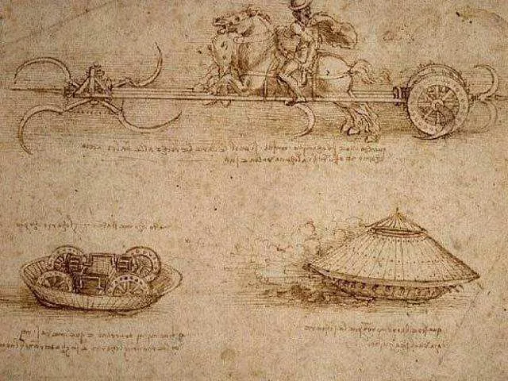

# Noticing a Project Idea 🤔

---

- [Steve Jobs Secrets of Life](https://www.youtube.com/watch?v=kYfNvmF0Bqw)

---

<!-- TODO: canyon river formation, mind's eye, culture, perspective -->

---

---

---

---

<!-- maybe there's a better way? -->

---

# Gretzky Theory of Innovation

> "Skate to where the puck is going, not where it has been."
> -- Wayne Gretzky

---

<!-- what does this look like? -->
<!-- what year do you think this is from? -->

* What does this look like?
* What year do you think this scene takes place?
* This is a concept called "Dynabook" developed by Alan Kay while at Xerox PARC (1968-72)
* Anything similar to this concept that would be hard to imagine living without? 😄
<!-- Many similar concepts also appeared in science fiction books/film -->

---
# What is the most important trait for building a new idea?

<!-- IQ? Knowledge or Skill? -->
---

# IQ?
<!-- raw horsepower -->
- Leonardo Da Vinci (1452–1519)
- Vast contributions to art, science, engineering, anatomy, and more!

---

---

---

Da Vinci's designs and concepts in engineering were far ahead of his time

---

---

---

---

---

<!-- It's cool to come up with these designs, but Leonardo would not have been able to make these dreams reality -->
Raw IQ is worth about as much as "lead" without "know how"

---

# Knowledge? Skill?
* Knowledge of how to do something
  * Coding
  * Engineering
  * Design
  * etc.
* Have a skill, what now?
* Having a skill is worth about as much as "silver"

<!-- work for someone else or be a consultant -->

---

# Point of View?
- Life experiences that shape your worldview
- Ability to see into the future and build what's missing
- **Point of View** + **Skill** + **IQ** is worth 100+ IQ points, better than gold!

---

# Point of View

## Elon Musk
- Potential for technology to solve humanity's most significant challenges, such as sustainable energy and the colonization of Mars

## Steve Jobs
- Technology should be both intuitive and beautifully designed

## Judy Faulkner
- Importance of patient care and the role of technology in enhancing the quality and accessibility of healthcare

---

- I recommend watching this video on [How to Get and Evaluate Startup Ideas](https://www.youtube.com/watch?v=Th8JoIan4dg)
- In this video Jared talks about some key questions to ask about any startup idea

---

# Are you the right person to solve this?
- Is this a field you have an expertise or insight?
- Think about your previous experiences and work.
- You may be uniquely suited to identify, understand, and solve a problem better than anyone else.

---

# How big is the market?
- Do a lot of people have this problem?
- More is usually better
- A lot of people have the problem **OR** a few people are willing to pay a lot to solve it
<!-- pricing -->
<!-- difficuly in finding users / customers -->

---

# How acute is the problem?
- Is it really painful and/or annoying?
- How often do people encounter this problem?
    - daily/weekly/monthly/yearly
    - more often is better

<!-- eg uber: I need to get places multiple times a day -->
<!-- buying a house: once a lifetime maybe? -->

---

# Do you have competition?
- This might be a good sign!
- Competition *might* validate that this is a real problem.

---
# Do you want this?
- You'll already have a first user... you!
- Are there a lot of other people like you?
<!-- would this make your job a lot easier / save time? -->
---

# Did this recently become possible or necessary?
- Has something about the world changed recently?
- New technology, law, problem, etc.

---
# Is this an idea you'd want to work on for years?
- Are you passionate about this problem?
- Do you have a personal connection?
- Do you like your user?

---

# Is this a good idea space?
- A good idea space has a lot of people with this problem willing to try your solution (and pay for it)
- Your first version will probably be wrong
- You will learn a lot by building, deploying and getting feedback from users
- If you're in a good idea space (high potential for success) you can iterate towards the optimal solution
- Check out our [Requests for Projects page](https://rfp.dpi.dev) for some good idea spaces

---

Generally, building something you find interesting or in a field you have an expertise or insight is a good start!

---

# More questions to consider

- What are you good at?
- Is there a problem you've personally encountered you can build a solution for?
- Is there something you just wish existed?
- Is there something about the world that has changed recently that has created an opportunity?
- Go out and talk to people! ([User Feedback 🗣️](https://github.com/DPI-WE/user-feedback))
- Is there a big industry that seems broken?

---

- Remember, we're just building fun learning projects to build your portfolio. I don't expect you to change the world,... yet. 😅

---

- I recommend you start writing down ideas you notice organically and rank them on these key questions.
- Something like [this](https://docs.google.com/spreadsheets/d/1NbArEqqP3hkypg1e0G2TnCVIIbSrmaD9ixxFV_sFHNk/edit?usp=sharing)
- Focus on the **problem** / **pain point** you plan to address

---

- Your proposal should answer these questions:
  1. What pain point do you want to address?
  2. Who has this problem?
  3. What do people do to solve this problem today?
  4. What are some good questions to ask these potential users?
- Remember, the verb you want to be using with respect to ideas is *not* "think up" but "notice." https://paulgraham.com/startupideas.html

---

- **Start with the problem**
- From there you can start formulating a hypothesiss on how to approach solving this problem.
- Solutions are easy to change, problems generally don't change.
---

# Assignment
- Please submit your proposal(s) including answers/scores/rankings to some of these key questions on a spreadsheet. [example](https://docs.google.com/spreadsheets/d/1NbArEqqP3hkypg1e0G2TnCVIIbSrmaD9ixxFV_sFHNk/edit?usp=sharing)
- Please reach out for a 1on1 with an instructor, TA, or fellow trainee and talk through what your ideas.

---

# Further Learning
- [Steve Jobs Secrets of Life](https://www.youtube.com/watch?v=kYfNvmF0Bqw)
- [Alan Kay: How to invent the future](https://www.youtube.com/watch?v=1e8VZlPBx_0)
